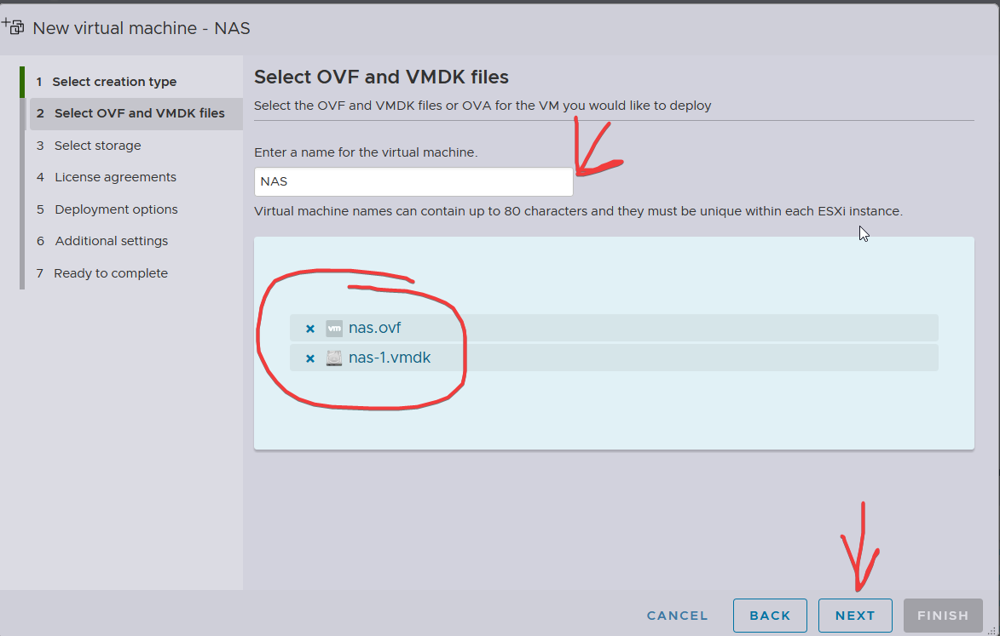

# Установка и настройка VMware ESXi с виртуальными машинами

## Команды
Команды:
- cd - перемещение в каталог 
- touch - создание файла 
- mkdir - создание каталога 
- rmdir - удаление пустого каталога 
- rm - удаление файла 
- rm -r - удаление каталога и его содержимого 
- cp - копирует файл или каталог 
- cat - вывод содержимого в файле 
- cp -r копирует один каталог в другой 
- mv - перемещает или переименовывает файл или каталог 
- pwd - выводит путь от корня к месту, где мы находимся 
- ls - выводит список содержимого каталога в котором мы находимся 
- cd .. - поднимает на уровень выше 
- nano, gedit, pico, vim -редакторы 
- sudo useradd - m - создаёт новых пользователей 
- usermod - редактирует параметры ранее созданных пользователей 
- userdel - удаляет раннее созданных пользователей 
- passwd - задаёт или изменяет пароль пользователя 
- apt-get - обращаемся к пакетному менеджеру 
- install(установить, удалить или обновить) vim(название приложения) 
- cat(можно посмотреть содержимое файла) main.py 
- ps - какие процессы запущены 
- whoami - показать текущего пользователя 
- groups <пользователь> - список групп пользователя 
- chown sit /home/sit/itmo.txt - изменить владельца файла 
- chgrp sit /home/sit/itmo.txt - изменить группу владельца файла 
- chmod +x /home/sit/itmo.sh - изменить права на файл 
- sudo su - права суперпользователя 
- id - печать идентификатора пользователя 
- sudo apt update - обновить репозитории 
- sudo apt upgrade - установить обновления 
- sudo apt install tasksel - ПО для автоматической установки набора программ(для сайтов, файловых менеджеров и т.д.)

## Модуль А1: Установка сервера виртуальных машин VMware ESXi

### Подготовка оборудования

**На площадке будет 2 компьютера:**
- Компьютер **server** для установки VMware ESXi
- Компьютер **client** для управления сервером (Windows или Linux)
## Если на сервере не будет предустановлен ESXI, то нам ещё должны выдасть(наверное):
- USB-накопитель с установочным образом ESXi

### Установка VMware ESXi
1. **Подготовка BIOS**:
   - Вставить USB-накопитель в компьютер **server**
   - Заходим в BIOS(перебираем все возможные клавиши для захода в BIOS: Del, F1, F2, F10, F12 или Esc)
   - Заходим в бут раздел, там ставим флешку на первое место
3. **Установка**:
   - Запустить сервер и дождаться загрузки установщика ESXi
   - Согласиться со всеми условиями
   - Выбрать раскладку клавиатуры **US default**
   - Если попросят выбрать диск, то просто выбираем и ждём дальше
   - Установить пароль `passw0rd!X`, где **X** – номер участника
   - Подтвердить установку и дождаться перезагрузки
   - **ВАЖНО:** Перед перезагрузкой извлечь USB-накопитель

4. **Первичный запуск**:
   - После перезагрузки на экране появится IP-адрес сервера (например, `192.168.1.27`)
   - Если все правильно сделали, после перезагрузки должна загрузиться вот такая шутка:


5. **Доступ к веб-интерфейсу**:
   - Открыть браузер на клиентском ПК и ввести `https://192.168.1.27`
   - Войти в систему:
     - **Логин:** `root`
     - **Пароль:** `passw0rd!X`

Попадаем сюда:


### Настройка хранилища (datastore)
1. Перейти в **Storage** (в левом столбце)
2. Проверяем, что datastore1 есть в списке
3. Если хранилище отсутствует:
   - Нажать **New Datastore**

   - Выбрать **Create new VMFS datastore**

   - Указать название `datastore1`
   - Выбрать диск и выделить нужное пространство
   - Нажать **Finish**

## Модуль А2: Создание виртуальных машин

### Имена виртуальных машин
- **Веб-серверы:** `web-teamX-01`, `web-teamX-02`
- **Серверы баз данных:** `base-teamX-01`, `base-teamX-02`
  - **X** – номер участника

### Характеристики виртуальных машин
**Веб-серверы (web-teamX-01, web-teamX-02):**
- Процессор: 2 ядра и более
- ОЗУ: 4 ГБ и более
- Диск: 25 ГБ и более
- Сеть:
  - **WAN network** (DHCP)
  - **LAN network** (Static) - **ВАЖНО: ВОЗМОЖНО ЭТОЙ ЧАСТИ ДАЖЕ НЕ БУДЕТ В ЗАДАНИИ, ПОЭТОМУ ПУНКТ Настройка сети МОЖНО ПРОПУСТИТЬ, ЕСЛИ НЕ БУДЕТ!**
- ОС: Ubuntu Server x64 или Windows 10 x64

**Серверы баз данных (base-teamX-01, base-teamX-02):**
- Аналогичные параметры

### Настройка сети
1. Перейти в **Networking → Virtual Switches**
2. Создать **LAN**


4. Перейти в **Networking → Port Groups**
5. Создать группу **LAN** и привязать к `LAN switch`


### Скачиваем файлы с NAS
1. Перейти в **Virtual Machines → Create/Register VM**
2. Дальше по скринам



3. Отрываем NAS
4. Нажимаем E, чтобы поменять код загрузчика.
   
5. Ищем строки, как на скрине, меняем test на boot
   


6. Нажимаем F10 и грузимся в систему
   
7. На текущем образе NAS логин adam, а пароль 123u (В задании, возможно, будут другие данные)
8. Проверяем статус работы ftp (vsftpd, должна быть строчка Active: Active, если Active: Inactive, то смотрим ниже)
   
Логинимся под админом

```bash
sudo su
```

Попросит пароль, вводим его. Теперь не придётся каждый раз писать sudo перед командой. 

```bash
systemctl status vsftpd
```

- Если не работает:
```bash
systemctl start vsftpd
```

Либо просто включаем сервис ssh, чтобы подключиться по sftp (systemctl start ssh). Гайд на подключение по sftp внизу.

9. Подключаемся по FileZilla к серверу и выкачиваем все файлы на клиента.


### Установка виртуальных машин
1. Перейти в **Virtual Machines → Create/Register VM**
2. Выбрать **Create a new virtual machine**
3. Заполнить параметры:
   - **Name** В соответствии с типом виртуалки (web-teamX-01 web-teamX-02 base-teamX-01 base-teamX-02) 
   - **Guest OS Family:** Linux
   - **Guest OS Version:** Задаём всё что угодно, желательно Ubuntu Server выбрать
4. Нажимаем Next, в открывшемся окне делаем следующее:
   - Характеристики ставим в соответствии с теми, что указаны в задании
   - **CD/DVD Drive 1:** Host Device > Database ISO File > Upload > Указать ISO-образ с `nas` (гайд на nas будет). После того, как образ загрузится, выбираем его.
   - Не забываем добавить второй Network Adapter для нашей LAN сети (Add Network Adapter) - **ЕСЛИ ЗАДАНИЯ С LAN НЕ БУДЕТ, ТО ПРОПУСКАЕМ** 
5. Завершить создание

7. Запустить установку ОС, выбрать **Try or Install Ubuntu Server**


Выбираем русский язык:


Если предложит обновиться, то скипаем.

Раскладку - ENGLISH US

Выбираем обычный Ubuntu Server (НЕ MINIMIZED). Выбрать какой-то пункт можно через пробел.

### Настройка сетевых параметров


1. **WAN (DHCP):** автоматически получает IP
2. **LAN (Static) - ЕСЛИ БУДЕТ В ЗАДАНИИ:**
   - Перейти во второй interface → **Edit IPv4** → **Manual**
   - Дальше уже спорная ситуация: В задании есть модуль А3 (Так же необходимо произвести настройку сетевых адаптеров на виртуальных машинах согласно адресам из таблицы.) Если задания со статическими адресами не будет, то, возможно, и модуля А3 не будет. Если таблица будет, то делаем по таблице. Если таблицы не будет,
   а задание делать надо, то указываем Subnet Mask 192.168.2.0/24, а айпи 192.168.2.X, где X - любое число до 255, оно должно быть уникальным для каждой виртуалки.

Настройки прокси пропускаем, проверку сети ждём.

Когда пойдёт разметка диска, то просто везде нажимаем "Готово".

### Создание пользователя
- Server name: в соответствии с названием виртуалки (web-teamX-01 И Т.Д.)
- Имя: `team_X`
- Пароль: `pass_X` (где X – номер участника)

Ставим галочку на Install OpenSSH, остальное скип.

### Автозапуск ВМ
1. Перейти в **Host → Manage → Autostart**
2. Включить **Enable Autostart**
3. Включить автозапуск для каждой ВМ (должен появиться Autostart Order для ВМ вместо Unset)

Когда загрузились в ОС, логинимся под своими данными

### Работа с терминалом
Логинимся под админом
```bash
sudo su
```
Попросит пароль, вводим его. Теперь не придётся каждый раз писать sudo перед командой. 

### Обновление ОС
```bash
apt update
apt upgrade
```

### Проверка и запуск SSH и SFTP
Проверяем статус работы SSH (должна быть строчка Active: Active, если Active: Inactive, то смотрим ниже)
```bash
systemctl status ssh
```
- Если не работает:
```bash
systemctl start ssh
```

### Подключение по SFTP через FileZilla
1. Открыть **Site Manager** → **New Site** (слева сверху иконка Open the Site Manager (под "Файл"))
2. Протокол: `SFTP`
3. Порт: `22`
4. Ввести IP виртуальной машины (узнать через `ip a`, ищем ip, который отличный от того, который мы указывали в качестве статического для LAN. Это и будет наш WAN адрес)
   


### Полезные команды
```bash
ls - список файлов
nano /путь/к/файлу - редактирование файла
```

На этом настройка завершена!
