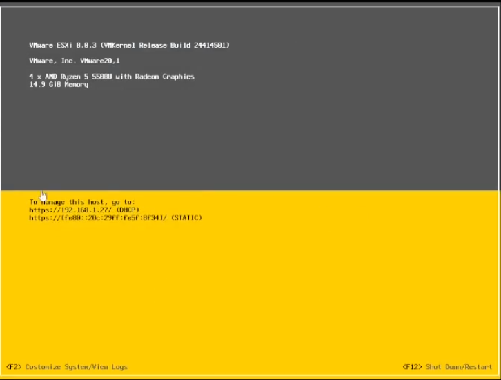
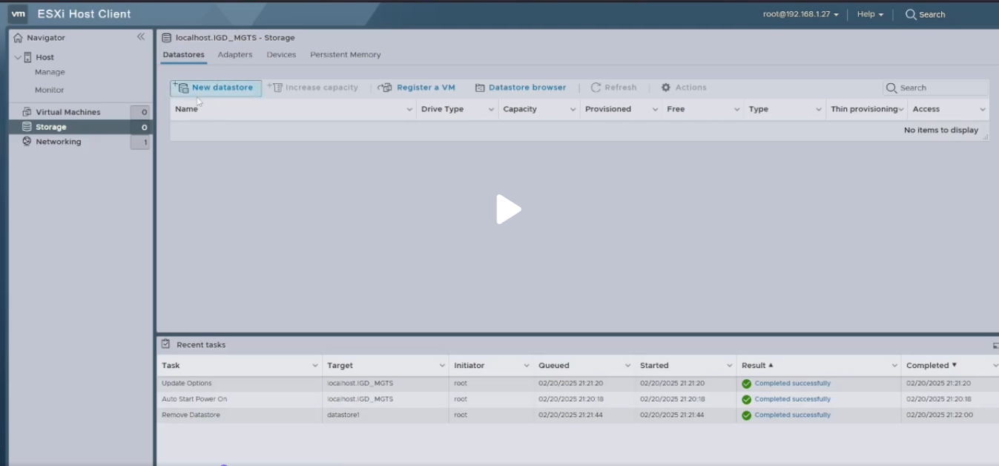
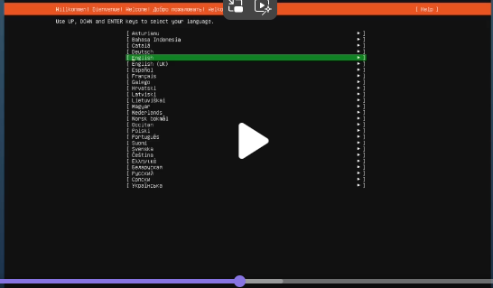
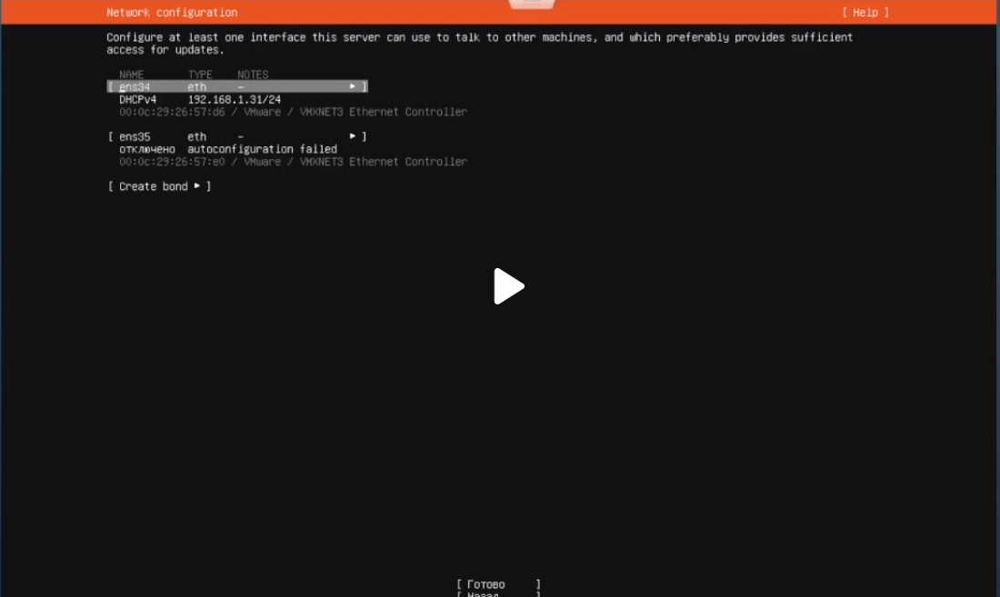

Команды:
- cd - перемещение в каталог 
- touch - создание файла 
- mkdir - создание каталога 
- rmdir - удаление пустого каталога 
- rm - удаление файла 
- rm -r - удаление каталога и его содержимого 
- cp - копирует файл или каталог 
- cat - вывод содержимого в файле 
- cp -r копирует один каталог в другой 
- mv - перемещает или переименовывает файл или каталог 
- pwd - выводит путь от корня к месту, где мы находимся 
- ls - выводит список содержимого каталога в котором мы находимся 
- cd .. - поднимает на уровень выше 
- nano, gedit, pico, vim -редакторы 
- sudo useradd - m - создаёт новых пользователей 
- usermod - редактирует параметры ранее созданных пользователей 
- userdel - удаляет раннее созданных пользователей 
- passwd - задаёт или изменяет пароль пользователя 
- apt-get - обращаемся к пакетному менеджеру 
- install(установить, удалить или обновить) vim(название приложения) 
- cat(можно посмотреть содержимое файла) main.py 
- ps - какие процессы запущены 
- whoami - показать текущего пользователя 
- groups <пользователь> - список групп пользователя
- chown sit /home/sit/itmo.txt - изменить владельца файла 
- chgrp sit /home/sit/itmo.txt - изменить группу владельца файла 
- chmod +x /home/sit/itmo.sh - изменить права на файл 
- sudo su - права суперпользователя 
- id - печать идентификатора пользователя 
- sudo apt update - обновить репозитории 
- sudo apt upgrade - установить обновления 
- sudo apt install tasksel - ПО для автоматической установки набора программ(для сайтов, файловых менеджеров и т.д.)

Решение:

2 компьютера:

1-ый комп – клиент (винда или убунту)

2-ой комп – сервер (esxi)

/// Уставновка ESXI \\\
По идеи на втором компе сразу установлен или если не уставновлен ESXI то с флешки сами устанавливаем  
Вставляем флешку 
Заходим в биос – бут раздел и ставим подгрузку с флешки на 1 место 
Запустили сервер ждем загрузки  
После загрузки со всем соглашаемся и когда просит раскладку ставим US default 
Пароль ставим как в задании  
Пароль к учетной записи root на компьютере server должен иметь вид passw0rd!X, где Х — это номер участника. 
После ввода пароля просто соглашаемся со всем и ждем (и когда увидите что будет ребут системы то вытащить флешку) 
Если все правильно сделали после перезагрузки должна загрузиться вот такая шутка  

 

Дальше на ПК клиенте переписываем хост в браузер ( в данном случае 192.160.1.27) 

 
 
Попадаем сюда  
Логин это – root 
пароль - passw0rd!X, где Х — это номер участника. 

 
 
Переходим в Storage (в левом столбце) 
Проверяем что datastore1 появился 
Если вдруг он не появился то делаем следующее; 

   

Нажимаем new datasore (Синим выделено на фото) 

 
 
Create new VMFS datastore 
Назвать как нибудь (желательно datastore1) 
Выбрать диск на котором это все будет 
Дальше выбираем сколько будет использоваться от диска , ставим весь размер ( ну или сколько вам надо) 
В конце прожимаем финиш и все 
На этом модуль А1 закончен   
Модуль А2 
МОДУЛЬ А2 
Виртуальные машины должны иметь следующие названия:  
- виртуальные машины №1, 2 (веб-сервер)  - web-teamX-01 и web-teamX-02 
- виртуальные машины №3, 4 (сервер баз данных) – base-teamX-01 и base-teamX-02 
где Х — это номер участника. 

Характеристики виртуальной машины №1 и №2 (веб-сервера) должны удовлетворять следующим условиям:  
 - Процессор : не менее 2-х ядер
 - Оперативная память: не менее 4 гб.
 - Жесткий диск: не менее 25 гб.
 - Сетевая карта 1: WAN network (DHCP)
- Сетевая карта 2: LAN network (Static)
 - Операционная система: Ubuntu server x64 или Windows 10 x64  

Характеристики виртуальной машины №3, 4 (сервера баз данных) должны удовлетворять следующим условиям: 
 - Процессор : не менее 2-х ядер
 - Оперативная память: не менее 4 гб.
 - Жесткий диск: не менее 25 гб.
 - Сетевая карта 1: WAN network (DHCP)
- Сетевая карта 2: LAN network (Static)
 - Операционная система: Ubuntu server x64 или Windows 10 x64 
Операционные системы 
Для установки операционных систем необходимо подключение к интернету.  
Необходимо произвести обновление пакетов операционных систем до актуальной версии на виртуальных машинах. 
Для входа в операционную систему необходимо создать пользователя с именем team_x и паролем pass_x, где x это номер участника.  
Так же необходимо реализовать автостарт виртуальных машин при старте сервера. 
 
Решение  
Создание LAN если будет задание то выполняем , если нет то нет 
Переходим в networking далее в Virtual swithes 
Создаем свою с названием LAN   

 

Переходим в Networking (Левый стобец) 
Создаем новую группу (Add port group) 
Называем и задаем virtual swith – LAN  
и добавляем через ADD 

 
 

Должно получится такое  
Создание виртуальных машин; 
Переходим в Virtual machines -  create / Register VM 

 
 

Guest os family – linux 
guest os version Ubuntu Server (64 bit) 
И далее по инструкции задания 
Cd\dvd drive1 там загружаем с nas . iso-шник для определенной группы машин(веб или просто серв) 
После всех загрузок  

  

Выбираем первое ( Try or install ubuntu server) 

  
 
В конце если все хорошо такая штука 
Язык русский 
Обновление скипаем 
РАСКЛАДКУ – АНГЛИЙСКАЯ (EANGLISH US) 
Далее выбираем обычный убунту сервер 
У нас будет 2 сети 
 
  

Верхняя – WAN (DHTP) сеть она автоматически айпишник выдает 
Нижняя LAN – статичная тут сами задаем айпи  
Нажимаем где ens35 eth- \ выбираем edit ipv4 \ выбираем вручную \  
Подсеть – 192.168.2.0/24 
адрес- 192.168.2.201 – второй сервер - 192.168.2.202 – третий 192.168.2.203 и тд 
сохраняем и готов дальше все скип 
Имя сервера и пароль по заданию 
 Ставим – Install OpenSSH server 

Автостарт – в клиетне – Host/Manage/Autostart/Edit и включаем ниже для каждой машины ставим автостарт Enable 
После полной загрузкой данных на сервере перед перезагрузкой заходим в виртуал мишин , на наш сервер и в edit и cd/dvd drive1 отключаем и перезагружаем 
После того как система загрузилась вводим логин и пароль 
Ставим обновления 
вводим sudo su , далее энтер и наш пароль 
пишем -  apt update 
Далее – apt upgrade 
На этом все , далее  
Передача файлов через Filezilla 
Проверяем работает ли ssh протакол 
systemctl status ssh должно быть зеленым enabled (!!!! так же строчка Active: Active должна быть 
Если она выглядит так Active: Inactive(dead) то у вас не рабоатет)!!!!!!!) 
Если не рабоат вводим : systemctl start ssh 
Заходим в файлзиллу слева сверху иконка Open the Site Manager (под file) 
нажимаем – new site и как то называем  
вместо протокола ftp пишем sftp порт 22 
Как узнать ip  
Пишем в командной строке на виртуальной машине: ip a 
ip адрес ищем который выходит в интернет 
чтоб проверить файлы в папке на сервере  
ls /ваш путь/… 
чтоб прочитать файлик пишем  
nano /ваш путь/… и название файла с расширением 
