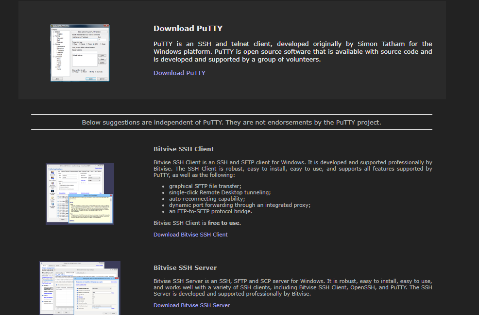
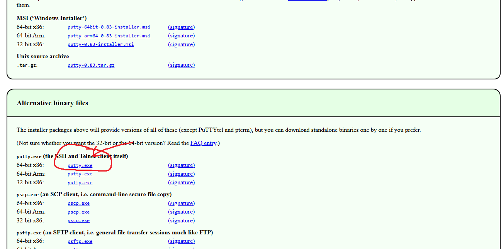
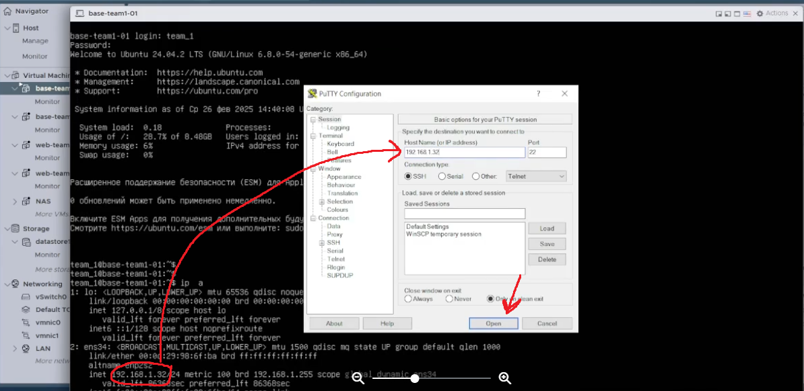
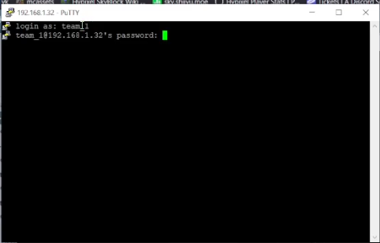
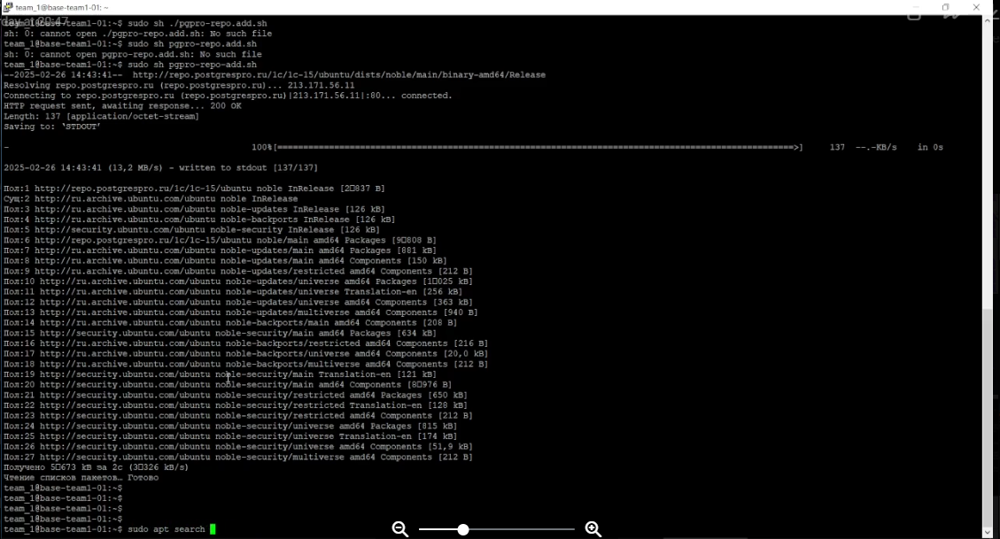
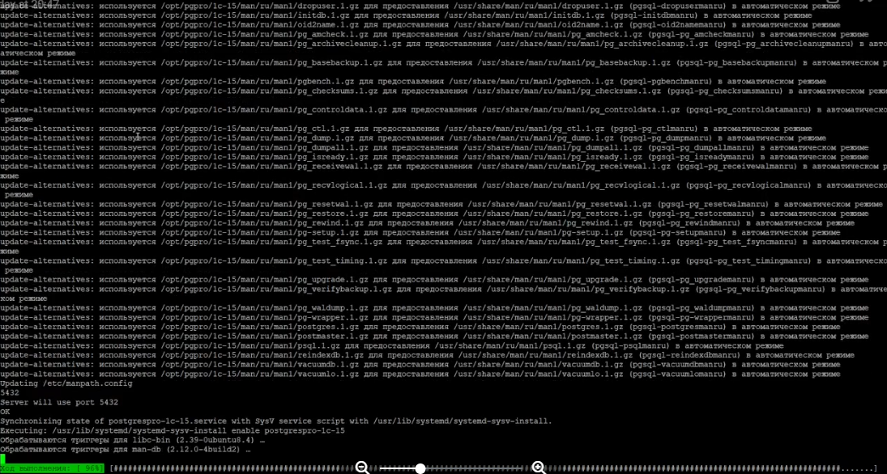

# Введение
Данный модуль предназначен для создания инфраструктуры с использованием виртуальных машин.  
Виртуальные машины позволяют эффективно использовать ресурсы физического сервера, запуская на нем несколько операционных систем или сервисов.  
Это значительно снижает затраты на оборудование и позволяет получить больше ресурсов для выполнения вычислений и задач.

# Задача
Участники самостоятельно выполняют задания поэтапно, эксперты визуально фиксируют выполнение заданий.  
Участникам разрешено пользоваться интернетом **без авторизации на внешних ресурсах**; при этом разрешается авторизация на **VMWare ESXI**.  
Можно устанавливать дополнительные приложения, не требующих авторизации.

**Необходимо:**
- Произвести обновление пакетов операционных систем на виртуальных машинах **№1, №2, №3 и №4**.
- Развернуть следующие приложения на созданных виртуальных машинах:
  - **lamp-server** на виртуальных машинах **№1 и №2**
  - **Сервер баз данных PostgreSQL** на виртуальных машинах **№3 и №4**

# МОДУЛЬ Б1
На виртуальной машине **№3 и №4** необходимо:
- Добавить из папки с дистрибутивами репозиторий с базой данных PostgreSQL и установить пакет из него.
- Произвести инициализацию базы данных.
- Создать пользователя с именем `userdbX` и паролем `passw0rd!X`, где **X** – это номер участника.
- Настроить встроенный firewall для доступа к базе данных.
- Создать базу данных для веб-сервера с названием `webdb`.

---

## Модуль Б1 – решение

### 1. Запуск
- **Запускаем** `base-teamX-01`.

> Если хотите быть крутыми и не сидеть в лагающем браузере, можно скачать программу [PuTTY](https://www.putty.org).



- **Инструкция по установке PuTTY:**
  - Перейдите по ссылке и нажмите **Download PuTTY**.
  - Выберите **64-bit x86** (самый первый во втором окне).



  - Откроется такое окно


- **Открываем виртуальную машину `base-teamX-01`:**
  - Введите логин и пароль.
  - Пропишите команду:
    ```bash
    ip a
    ```
  - Нажмите **Open** и в открывшемся окне снова введите логин и пароль (это наша виртуальная машина в удобном окне).

---



Вводим в окне логин и пароль (это наша же виртуалка просто в удобном окне)




### 2. Установка PostgreSQL
- **Открываем файл** `postgress1C repo.txt` – который выгрузили с НАСА (в проводнике, не в виртуалке).  
  В файле содержатся две команды. Первая может не работать, так как ссылка устарела. Если так, сначала откройте ссылку в браузере, а затем используйте рабочую версию в консоли.

- **Выполните следующие команды:**
  ```bash
  curl -o pgpro-repo-add.sh https://repo.postgrespro.ru/1c/1c-15/keys/pgpro-repo-add.sh (уже рабочая ссылка)
  sudo sh pgpro-repo-add.sh



Далее выполняем:

```bash
sudo apt install postgrespro-1c-15
```

Во время установки можно увидеть порт сервера (в данном случае `5432`); его лучше запомнить или записать.



Перейдите в нужную директорию и запустите PostgreSQL:

```bash
cd /
sudo su postgres
psql
```

---

### Создание пользователя

Гайд: [Как создать пользователя PostgreSQL](https://timeweb.cloud/tutorials/postgresql/kak-sozdat-polzovatelya-postgresql)

*(дальше сами , ладно шутка)*

В командной строке PostgreSQL выполните:

```sql
CREATE USER userdbX WITH PASSWORD 'passw0rd!X' SUPERUSER;
```

> Где **X** – ваш номер участника.

---

### Создание базы данных

Для создания базы данных [Тык](https://timeweb.cloud/tutorials/postgresql/kak-sozdat-polzovatelya-postgresql)

```sql
CREATE DATABASE webdb;
exit
```

---

### Настройка firewall

1. Переключаемся на пользователя с правами суперпользователя:

   ```bash
   sudo su
   ```

2. Проверяем статус firewall:

   ```bash
   sudo ufw status
   ```

   > Должен отображаться статус **инактив**.

3. Разрешаем необходимые порты:

   ```bash
   sudo ufw allow 5432   # или используйте порт, указанный при установке
   sudo ufw allow 22
   sudo ufw allow 9090
   sudo ufw enable
   ```

---

### Повторение на виртуальной машине BASE-TEAMX-02

# Выполните все вышеописанные шаги на виртуальной машине `base-teamX-02`.


На этом модуль **Б1** завершён.

# МОДУЛЬ Б2

На виртуальной машине **№1 и №2** необходимо установить из репозиториев через пакетный менеджер веб-сервер **LAMP**. Реализовать балансировку серверов и синхронизацию данных между машинами (например, через `rsync`). Настроить встроенный firewall для доступа к веб-странице. Из образа файлового хранилища установить **CMS Wordpress**, подключить к нему базу данных с виртуальных машин **№3 и №4**, после чего установить на него шаблон.

Также необходимо реализовать **мониторинг серверов**. Рекомендуемый способ — установить приложения **Grafana** и **Prometheus** из папки с дистрибутивами. Разместить компоненты мониторинга на всех серверах, а сервер мониторинга разместить на виртуальных машинах **№1 и №2**. Обеспечить доступ к странице мониторинга на порту `3000`. Показатели мониторинга с виртуальных машин должны выводиться на экране.

---

## Установка LAMP

**Запускаем `web-team-01`**  
[Ссылка для установки LAMP на Ubuntu](https://selectel.ru/blog/lamp-install-ubuntu/)

Устанавливаем необходимые пакеты:
```bash
sudo apt install tasksel
sudo tasksel
```
*Выбираем веб-сервер.*

Устанавливаем MySQL:
```bash
sudo apt install mysql-server
sudo mysql
```
Внутри MySQL создаем пользователя и БД:
```sql
CREATE USER 'userdbX'@'localhost' IDENTIFIED BY 'passw0rd!X';  -- X ваш номер
GRANT ALL ON *.* TO 'userdbX'@'localhost';
CREATE DATABASE webdb;
EXIT;
```

---

## PHP и установка Wordpress

Устанавливаем PHP и необходимые модули:
```bash
sudo apt install php libapache2-mod-php php-mysql
```

Подключаемся к FileZilla через левый верхний квадратик по SSH. **Wordpress** находится в архиве (файлы от НАСА). Разархивируйте архив с Wordpress и переместите все файлы в каталог:
```bash
cd /var/www/html
```

### Удаление index.html заглушки
Если не получается удалить, нужно получить права на виртуальной машине:
```bash
cd /var/www/
ls
ls -la
sudo chown team_X:team_X -R ./html
```
Теперь удалите заглушку и переместите файлы из папки с Wordpress.

Перезапускаем Apache:
```bash
sudo systemctl restart apache2
sudo systemctl enable apache2
```
После этого в браузере по нашему IP должен открываться сайт.

### Настройка базы данных для Wordpress

Заполните настройки базы данных в Wordpress. Если возникает ошибка, выполните:
```bash
sudo chown www-data:www-data -R ./html
```
После этого, в браузере нажмите «Вперед», затем заполните регистрационную форму. Логин и пароль ставим — **admin**. Почту любую

---

## Установка Prometheus

### Скачка Prometheus

Рекомендуемые ссылки:
- [Инструкция от Timeweb](https://timeweb.cloud/tutorials/servers/ustanovka-i-nastrojka-prometheus)
- [Официальный сайт Prometheus](https://prometheus.io/download/)
- [GitHub releases Prometheus](https://github.com/prometheus/prometheus/releases/)

Выберите версию под Linux (amd64) и скачайте её.

Открываем FileZilla и переносим скачанный архив Prometheus на сервер по пути:
```
/etc/home/team_X
```
*(Можно создать отдельную папку, например, `archives`.)*

> **Важно:** Скачиваем Prometheus на все 4 машины. **Grafana** устанавливаем только на 2 веб-сервера.

### Установка Prometheus

Заходим в виртуальную машину:
```bash
cd ~
ls
cd archives/
sudo tar -xzf <название_архива>
```
Удаляем архив после распаковки:
```bash
sudo rm <название_архива>
```
Переходим в распакованную папку (например, название начинается с `prometheus`):
```bash
cd prometheus*
```
Перемещаем бинарные файлы:
```bash
sudo mv prometheus /usr/local/bin
sudo mv promtool /usr/local/bin
```
Создаем каталог для конфигурационных файлов:
```bash
sudo mkdir /etc/prometheus
sudo mv prometheus.yml /etc/prometheus
sudo mkdir /var/lib/prometheus
```
Создаем сервис Prometheus:
```bash
sudo nano /etc/systemd/system/prometheus.service
```
Вставляем следующее содержимое:
```
[Unit]
Description=Background service of Prometheus
Wants=network-online.target
After=network-online.target

[Service]
Type=simple
ExecStart=/usr/local/bin/prometheus \
  --config.file /etc/prometheus/prometheus.yml \
  --storage.tsdb.path /var/lib/prometheus/

[Install]
WantedBy=multi-user.target
```
Сохраняем файл и выходим.

Далее в консоли:
```bash
sudo systemctl daemon-reload
sudo systemctl enable prometheus
sudo systemctl start prometheus
sudo systemctl status prometheus
```
Prometheus теперь доступен на порту `9090`.

Если папка с Prometheus "мозолит глаза", её можно удалить:
```bash
sudo rm <папка> -R
```

---

## Установка Grafana

Устанавливаем Grafana (файлы от НАСА):

1. Переносим архив Grafana через FileZilla в папку `archives`.
2. Выполняем в консоли:
   ```bash
   sudo apt install adduser libfontconfig1 musl -y
   sudo dpkg -i grafana-enterprise_10.0.2_amd64.deb
   sudo systemctl enable grafana-server
   sudo systemctl start grafana-server
   ```
Grafana доступна по порту `3000`. Логин и пароль — **admin**.

После входа нажмите на значок с тремя линиями для доступа к настройкам, затем перейдите на главный экран.

---

## Синхронизация и файерволы

### Файерволы на веб-серверах

На веб-серверах выполните:
```bash
sudo ufw allow 80
sudo ufw allow 443
sudo ufw allow 3306
sudo ufw allow 9090
sudo ufw allow 3000
sudo ufw allow 22
sudo ufw enable
```

### Синхронизация данных через rsync

На любом веб-сервере создайте папку `scripts`:
```bash
mkdir -p scripts
```
Проверьте наличие папки:
```bash
ls
cd ..
ls   # убедитесь, что папка scripts присутствует
cd scripts
```


Запустите тестовую синхронизацию:
```bash
sudo rsync -avz /var/www/html/ team_X@192.168.X.2:/var/www/html
```
> **Примечание:**  
> Формат команды:  
> `rsync -avz <откуда копируем> <пользователь и IP сервера>:<куда сохранять>`  
>  

На машине 192.168.X.2 выполняем команды:

ssh-keygen -t rsa -b 4096
ssh-copy-id team_1@192.168.X.1

Возвращаемся обратно на нашу первую машину, на ней в папке /home/team_x/scripts/ создаём скрипт sync.sh

В нём пишем

```bash
#!/bin/bash
sudo rsync -avz /var/www/html/ team_X@192.168.X.2:/var/www/html
```

Пробуем его запустить через sh sync.sh (если не просит пароль, значит всё хорошо)

Открываем менеджер расписаний через crontab -e

В конце прописываем следующее расписание

```bash
*/5 * * * * sh /home/team_x/scripts/sync.sh
```

Это будет запускать скрипт каждые 5 минут
# ЛУЧШЕ ПОМЕНЯТЬ ЗНАЧЕНИЕ, Т.К. ОЧЕНЬ СТРАННО, ЧТО У ВСЕХ ОДИНАКОВО! ЕСЛИ В ЗАДАНИИ БУДЕТ ВРЕМЯ, ТО СТАВИМ ТО, КОТОРЫЕ НАПИСАНО
# СГЕНЕРИРОВАТЬ РАСПИСАНИЕ МОЖНО ЧЕРЕЗ https://crontab.guru

### Повторяем все действия на виртуалке 2
### ВОЗМОЖНО, НО НЕ 100%, НУЖНО СДЕЛАТЬ СИНХРОНИЗАЦИЮ ПАПКИ /var/lib/pgpro/1c-15/data НА МАШИНАХ 3 И 4!

