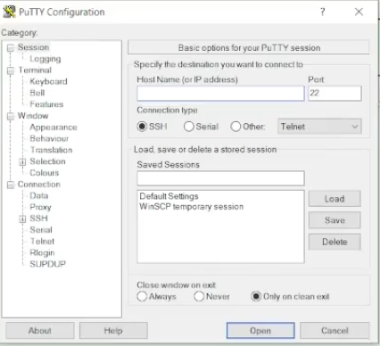

# Введение
Данный модуль предназначен для создания инфраструктуры с использованием виртуальных машин.  
Виртуальные машины позволяют эффективно использовать ресурсы физического сервера, запуская на нем несколько операционных систем или сервисов.  
Это значительно снижает затраты на оборудование и позволяет получить больше ресурсов для выполнения вычислений и задач.

# Задача
Участники самостоятельно выполняют задания поэтапно, эксперты визуально фиксируют выполнение заданий.  
Участникам разрешено пользоваться интернетом **без авторизации на внешних ресурсах**; при этом разрешается авторизация на **VMWare ESXI**.  
Можно устанавливать дополнительные приложения, не требующих авторизации.

**Необходимо:**
- Произвести обновление пакетов операционных систем на виртуальных машинах **№1, №2, №3 и №4**.
- Развернуть следующие приложения на созданных виртуальных машинах:
  - **lamp-server** на виртуальных машинах **№1 и №2**
  - **Сервер баз данных PostgreSQL** на виртуальных машинах **№3 и №4**

# МОДУЛЬ Б1
На виртуальной машине **№3 и №4** необходимо:
- Добавить из папки с дистрибутивами репозиторий с базой данных PostgreSQL и установить пакет из него.
- Произвести инициализацию базы данных.
- Создать пользователя с именем `userdbX` и паролем `passw0rd!X`, где **X** – это номер участника.
- Настроить встроенный firewall для доступа к базе данных.
- Создать базу данных для веб-сервера с названием `webdb`.

---

## Модуль Б1 – решение

### 1. Запуск
- **Запускаем** `base-teamX-01`.

> Если хотите быть крутыми и не сидеть в лагающем браузере, можно скачать программу [PuTTY](https://www.putty.org).


- **Инструкция по установке PuTTY:**
  - Перейдите по ссылке и нажмите **Download PuTTY**.
  - Выберите **64-bit x86** (самый первый во втором окне).


  - Откроется такое окно



- **Открываем виртуальную машину `base-teamX-01`:**
  - Введите логин и пароль.
  - Пропишите команду:
    ```bash
    ip a
    ```
  - Нажмите **Open** и в открывшемся окне снова введите логин и пароль (это наша виртуальная машина в удобном окне).

---


Вводим в окне логин и пароль (это наша же виртуалка просто в удобном окне)


### 2. Установка PostgreSQL
- **Открываем файл** `postgress1C repo.txt` – который выгрузили с НАСА (в проводнике, не в виртуалке).  
  В файле содержатся две команды. Первая может не работать, так как ссылка устарела. Если так, сначала откройте ссылку в браузере, а затем используйте рабочую версию в консоли.

- **Выполните следующие команды:**
  ```bash
  curl -o pgpro-repo-add.sh https://repo.postgrespro.ru/1c/1c-15/keys/pgpro-repo-add.sh (уже рабочая ссылка)
  sudo sh pgpro-repo-add.sh


Далее выполняем:

```bash
sudo apt install postgrespro-1c-15
```

Во время установки можно увидеть порт сервера (в данном случае `5432`); его лучше запомнить или записать.


Перейдите в нужную директорию и запустите PostgreSQL:

```bash
cd /
sudo su postgres
psql
```

---

### Создание пользователя

Гайд: [Как создать пользователя PostgreSQL](https://timeweb.cloud/tutorials/postgresql/kak-sozdat-polzovatelya-postgresql)

*(дальше сами , ладно шутка)*

В командной строке PostgreSQL выполните:

```sql
CREATE USER userdbX WITH PASSWORD 'passw0rd!X' SUPERUSER;
```

> Где **X** – ваш номер участника.

---

### Создание базы данных

Для создания базы данных [Тык](https://timeweb.cloud/tutorials/postgresql/kak-sozdat-polzovatelya-postgresql)

```sql
CREATE DATABASE webdb;
exit
```

---

### Настройка firewall

1. Переключаемся на пользователя с правами суперпользователя:

   ```bash
   sudo su
   ```

2. Проверяем статус firewall:

   ```bash
   sudo ufw status
   ```

   > Должен отображаться статус **инактив**.

3. Разрешаем необходимые порты:

   ```bash
   sudo ufw allow 5432   # или используйте порт, указанный при установке
   sudo ufw allow 22
   sudo ufw allow 9090
   sudo ufw enable
   ```

---

### Повторение на виртуальной машине BASE-TEAMX-02

# Выполните все вышеописанные шаги на виртуальной машине `base-teamX-02`.


На этом модуль **Б1** завершён.
