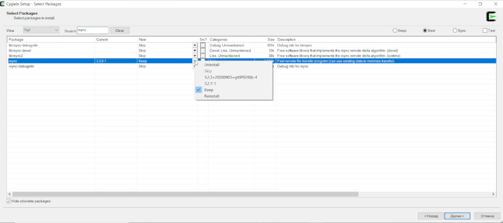
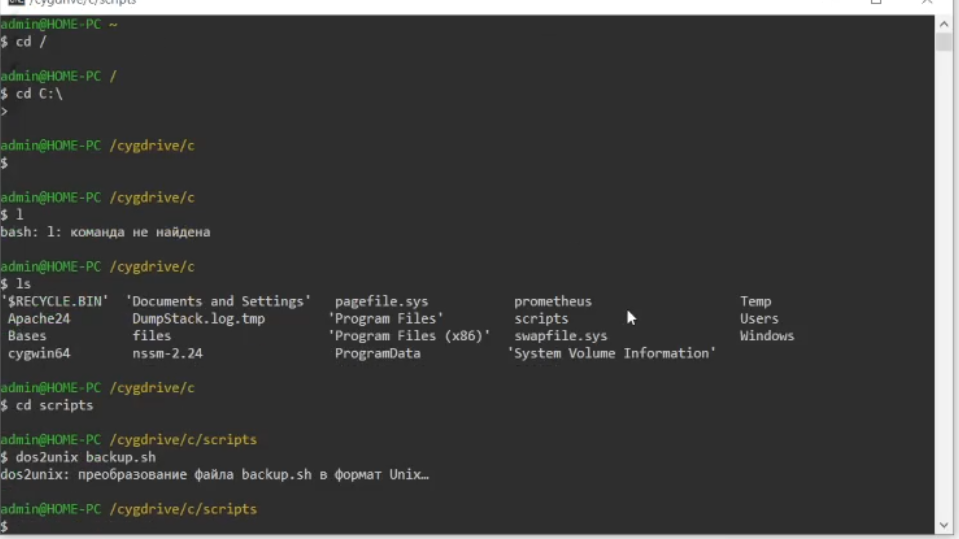

# Б3: Делаем Бэкапы

* На виртуалках 3 и 4 (base) создаём папки для бэкапов веба
  ```bsah
  cd ~
  mkdir backups
  cd backups
  mkdir web
  ```
* На виртуалках 1 и 2 создаём скрипт backup.sh в папке scripts (/home/team_x/scripts/backup.sh)
  ```bash
  nano /home/team_x/scripts/backup.sh
  ```
* В фалйе прописываем скрипт
  # НЕ ЗАБЫВАЕМ УКАЗАТЬ КОРРЕКТНЫЙ АЙПИ 3 И 4 ВИРТУАЛКИ СООТВЕТСТВЕННО
  ```bash
  #!/bin/bash
  DATE=$(date +"%Y-%m-%d-%H-%M-%S")
  rsync -avz /var/www/html/ team_1@192.168.2.X:/home/team_x/backups/web/$DATE
  ```
* Выдаём права на скрипт
  ```bash
  sudo chmod 777 /home/team_x/scripts/backup.sh
  ```
* # НЕ ЗАБЫВАЕМ ПРОКИНУТЬ КЛЮЧИ ЧЕРЕЗ SSS-COPY-ID (БЫЛО В ПРОШЛОМ ГАЙДЕ)
* Открываем cron через команду crontab -e (если попросит выбрать редактор, то выбираем 1)
* Вписываем нужное расписание
  ```bash
  0 0 * * * sh /home/team_x/scripts/backup.sh
  ```

* На виртуалках 1 и 2 (web) создаём папки для бэкапов базы
  ```bsah
  cd ~
  mkdir backups
  cd backups
  mkdir base
  ```

  * На виртуалках 3 и 4 создаём скрипт backup.sh в папке scripts (/home/team_x/scripts/backup.sh)
  ```bash
  nano /home/team_x/scripts/backup.sh
  ```
* В фалйе прописываем скрипт
  # НЕ ЗАБЫВАЕМ УКАЗАТЬ КОРРЕКТНЫЙ АЙПИ 1 И 2 ВИРТУАЛКИ СООТВЕТСТВЕННО
  ```bash
  #!/bin/bash
  DATE=$(date +"%Y-%m-%d-%H-%M-%S")
  rsync -avz /var/lib/pgpro/1c-15/data/ team_1@192.168.2.2:/home/team_1/backups/base/$DATE
  ```
* Выдаём права на скрипт
  ```bash
  sudo chmod 777 /home/team_x/scripts/backup.sh
  ```
* # НЕ ЗАБЫВАЕМ ПРОКИНУТЬ КЛЮЧИ ЧЕРЕЗ SSS-COPY-ID (БЫЛО В ПРОШЛОМ ГАЙДЕ)
* Выдадим себе права на папку постгреса
  ```bash
  sudo chmod 770 -R /var/lib/pgpro/1c-15/data/
  sudo gpasswd -a team_x postgres
  newgrp postgres
  ```
* Открываем cron через команду crontab -e (если попросит выбрать редактор, то выбираем 1)
* Вписываем нужное расписание
  ```bash
  0 0 * * * sh /home/team_x/scripts/backup.sh
  ```

# В: Ставим 1C

* Создаём новую виртуальную машину по характеристикам, которые указаны в задании (ВЫБИРАЕМ ISO ОБРАЗ WINDOWS)
* Ставим винду на виртуалку (не забываем установить имя пользователя и пароль на user_x и pass_x)
* Когда установили винду, нажимаем Win + R и пишем ncpa.cpl
* Выбираем наш LAN адаптер (у него не будет доступа в сеть, так что найти его лекго)
* Дальше открывааем по видео:


* # Естественно ставим свои локальные айпишники, в винде маска подсети выглядит по другому, так что просто пишем 255.255.255.0 и не паримся
* Переходим в Параметры > Система > Удалённый Рабочий Стол > Включить Удалённый Рабочий Стол
* В поиске КЛИЕНТА пишем "Подключение к удалённому рабочему столу"
* Туда WAN айпи и логин, дальше попросит пароль
* На клиентской машине выделяем архив с 1C и нажимаем Ctrl + C
* На подключённом рабочем столе нажимаем Ctrl + V
* Когда файл перекачается туда, то можно закрывать удалённый рабочий стол
* Возвращаемся в окно виртуалки, которое в ESXI
* Разархивируем архив
* Открываем папку с архивом и заускаем vc_redistX64.exe
* Ставим галочку и устанавливаем:


* После установки редиста открываем setup.exe
* Доходим до выборочной установки, устанавливаем всё, кроме Коннектор ИБ, Дополнительно и Доп. Языков


* Выбираем "Создать Пользователя" и ставим пароль pass_x


* Далее нажимаем далее и устанавливаем

* После установки не забываем убрать галочку с "Установить драйвер аппаратных ключей защиты"
* Далее запускаем файлы в том порядке, который на скрине


* Раскрываем локальный кластер


* ПКМ по информационной базе > Создать > Информационная База
* Дальше согласно скриншоту:


# УКАЗЫВАЕМ ЛОКАЛЬНЫЙ АЙПИ НАШЕЙ БАЗЫ ДАННЫХ (base-teamX-01)

* Настраиваем 1C предприятие по видео (ЕСЛИ БУДЕТЕ ПЕРЕКИДЫВАТЬ ИНФОРМАЦИОННУЮ БАЗУ НА КОМП КЛИЕНТА, ТО УКАЗЫВАЕМ WAN АЙПИ ВМЕСТО localhost)


# Настраиваем Apache2

[Гайд/Источник](https://maxiplace.ru/blog/bitrix/veb-publikaciya-1s-osnovnye-aspekty/)

* Скачиваем Apache по [ссылке](https://www.apachelounge.com/download/) ФАЙЛ (httpd-2.4.63-250207-win64-VS17.zip)
* Закидываем папку Apache24 из архива на диск C
* Не забываем удалить файл index.html из C:\Apache24\htdocs
* Открываем PowerShell и прописываем
```bash
C:\Apache24\bin\httpd.exe -k install
New-NetFirewallRule -DisplayName "Apache 2.4" -Direction Inbound -Action Allow -EdgeTraversalPolicy Allow -Protocol TCP -LocalPort 80,443
```

* Тут обе галочки


* В поиске пишем "Службы" и запускаем службу Apache 2.4 (ПКМ ПО СЛУЖБЕ > Запустить)
* В проводнике переходим в Диск C > Program Files > 1cv8 > ТУТ_ВЕРСИЯ_1С > bin
* Копируем сверху путь до папки
* В cmd или powershell пишем cd этот_путь_сюда
* Выполняем команду
```bash
webinst -publish -apache24 -wsdir test -dir "C:\Apache24\htdocs" -connstr "Srvr=localhost;Ref=ТУТ_ВСТАВИТЬ_НАЗВАНИЕ_ИНФОРМАЦИОННОЙ_БАЗЫ(db в моём случае)"
C:\Apache24\bin\httpd.exe -k restart
```
* Переходим по нашему WAN айпи и проверяем работу (возможно придётся добавить /test в конец ссылки)

# Ставим Prometheus на Windows

[Гайд/Источник](https://ultravds.com/blog/kak-ustanovit-prometheus-na-windows-server/)

* Открываем прошлый гайд и скачиваем Prometheus, но уже под виндовс
* Папку внутри архива на диск C
* Скачиваем программу [NSSM](https://nssm.cc/download)
* Папку внутри архива с NSSM на диск C
* Дальше в cmd или Powershell cd C:\nssm-2.24\win64
* Потом команду nssm install Prometheus
* В окне выбираем файл prometheus.exe
* В Arguments --config.file=prometheus.yml
* Нажимаем Install Service
* Переходим в службы и включаем службу Prometheus
* Нажимаем Win + R и пишем firewall.cpl
* Выбираем "Дополнительные Параметры"
* Слева "Правила Для Входящих подключений"
* Справа "Создать Правило"
* Выбираем "Для Порта" > Определённые локальные порты (9090) > Далее > Далее > Имя Prometheus
* В Grafana подключаем наш Prometheus

# Делаем бэкапы

* Скачиваем [Cygwin](https://www.cygwin.com/) - UNIX подобная среда для Windows
* Открываем setup
* Всегда нажимаем далее, когда попросит выбрать зеркало, то выбираем абсолютно любое (можно первое)
* В открывшемся окне ставим View: Full
* В поиске пишем rsync, в столбце New выбираем последнюю версию (3.3.0-1)


* Аналогично ищем openssh и dos2unix
* Завершаем установку
* Добавляем файлы cygwin в переменные окружения:


* На рабочем столе появится иконка терминала, открываем его
* Нужно сделать 2 файла для бэкапа на виртуалки 1 и 3 (не забудьте создать папку /backups/base/ на этих виртуалках)
* На диске C создадим папку scripts, там создадим эти 2 скрипта:
```bash
  #!/bin/bash
  DATE=$(date +"%Y-%m-%d-%H-%M-%S")
  rsync -avz "/cygdrive/c/Program Files/1cv8/" team_1@192.168.2.X:/home/team_1/backups/base/$DATE
```

Будем бэкапить папку 1cv8, тк в задании какую именно надо бэкапить не сказано.

* Прокидываем ключи ssh на виртуалки 1 и 3 (команды в модуле б) ДЕЛАЕМ ВСЁ ЭТО В ТЕРМИНАЛЕ CYGWIN
* Конвертируем скрипты в формат unix, В терминале пишем:
```bash
cd C:\
cd scripts
dos2unix backup_1.sh
dos2unix backup_2.sh
```



* Открываем планировщик заданий
* Слева выбираем Библиотеку Планировщика
* Справа выбираем Создать Простую Задача
* Задаём любое имя
* Выбираем Ежедневно
* Далее
* Действие - Запустить Программу
* В "Программа как сценарий" пишем
```bash
C:\cygwin64\bin\bash.exe C:\scripts\тут_название_файла_вашего_backup_скрипта.sh
```

* Протестить задачу можно, если нажать ПКМ > Выполнить
